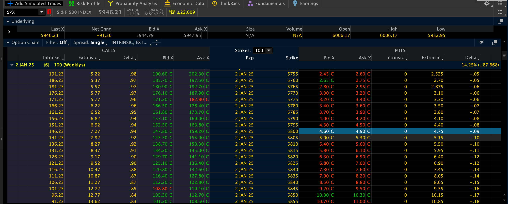

# Trading Ideas

## 12/27/2024

- The premiums for options the SPX are pretty high. You'd need at least $60000 in capital, but selling a single option contract on the SPX could fetch between $5000 and $10000 in premium. That's anywhere from a 8% to 16% return over 30-60 days.

