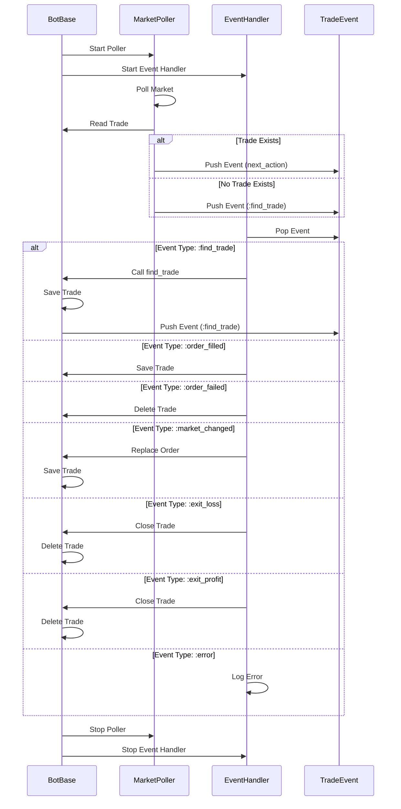

```mermaid
sequenceDiagram
    participant BotBase
    participant MarketPoller
    participant EventHandler
    participant TradeEvent

    BotBase->>MarketPoller: Start Poller
    BotBase->>EventHandler: Start Event Handler

    MarketPoller->>MarketPoller: Poll Market
    MarketPoller->>BotBase: Read Trade
    alt Trade Exists
        MarketPoller->>TradeEvent: Push Event (next_action)
    else No Trade Exists
        MarketPoller->>TradeEvent: Push Event (:find_trade)
    end

    EventHandler->>TradeEvent: Pop Event
    alt Event Type: :find_trade
        EventHandler->>BotBase: Call find_trade
        BotBase->>BotBase: Save Trade
        BotBase->>TradeEvent: Push Event (:find_trade)
    else Event Type: :order_filled
        EventHandler->>BotBase: Save Trade
    else Event Type: :order_failed
        EventHandler->>BotBase: Delete Trade
    else Event Type: :market_changed
        EventHandler->>BotBase: Replace Order
        BotBase->>BotBase: Save Trade
    else Event Type: :exit_loss
        EventHandler->>BotBase: Close Trade
        BotBase->>BotBase: Delete Trade
    else Event Type: :exit_profit
        EventHandler->>BotBase: Close Trade
        BotBase->>BotBase: Delete Trade
    else Event Type: :error
        EventHandler->>EventHandler: Log Error
    end

    BotBase->>MarketPoller: Stop Poller
    BotBase->>EventHandler: Stop Event Handler
```